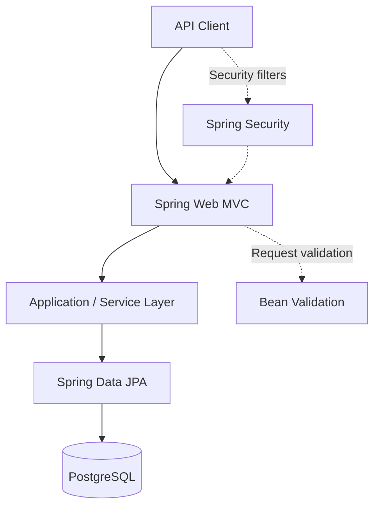

<div align="center">

# 🛒 ScaleCart
### High-Scale E-Commerce & Order Processing System

**A Java and Spring Boot backend project focused on building a maintainable foundation for e-commerce and order-processing workflows.**

[](https://www.java.com/)
[](https://spring.io/projects/spring-boot)
[](https://www.postgresql.org/)
[](https://maven.apache.org/)

[Repository](https://github.com/Shreyansh-10-oss/ScaleCart) · [Report an Issue](https://github.com/Shreyansh-10-oss/ScaleCart/issues)

</div>

---

## Overview

ScaleCart is a backend-focused e-commerce project built with **Java 21, Spring Boot, and PostgreSQL**. It explores the design of an order-processing service, with an emphasis on clean API boundaries, persistent data, input validation, and application security.

The long-term goal is to evolve the system toward reliable processing under concurrent requests, where operations such as inventory updates and order creation must remain consistent.

> **Project status:** Under development. This README documents confirmed dependencies and the intended architectural direction. Features, endpoints, performance figures, and infrastructure integrations should be considered implemented only when reflected in the source code.

## Tech Stack

| Layer | Technology | Purpose |
| --- | --- | --- |
| Language | Java 21 | Backend development |
| Framework | Spring Boot 4.1.1 | Application configuration and runtime |
| Web | Spring Web MVC | HTTP/REST application support |
| Persistence | Spring Data JPA | Object-relational data access |
| Database | PostgreSQL | Relational data storage |
| Security | Spring Security | Security configuration and controls |
| Validation | Spring Validation | Request and model validation |
| Build | Maven | Dependency management and builds |
| Utilities | Lombok | Reduce Java boilerplate |
| Testing | Spring Boot Test | Application testing dependencies |

## Architecture

The project uses a Spring-based backend foundation. A typical request flow for the intended service architecture is:



*This diagram is a conceptual overview of the intended layered architecture, not a claim about the exact classes currently present.*

## Engineering Focus

The following areas guide the project's development:

- **Order lifecycle design:** Modeling the transition from an incoming order request to a persisted order.
- **Database consistency:** Managing related database changes through well-defined transactional boundaries.
- **Concurrent requests:** Evaluating approaches to prevent overselling and inconsistent inventory updates.
- **API design:** Creating clear request/response contracts, validation, and meaningful error handling.
- **Security:** Applying appropriate application security controls to protected operations.
- **Testability:** Keeping business logic modular and verifiable with automated tests.

These are design priorities; consult the codebase for the current implementation status of each area.

## Repository Layout

```text
ScaleCart/
└── scalecart/
    └── pom.xml          # Maven project configuration
```

The repository also contains an `.idea/` directory. Source directories and packages should be explored within `scalecart/` as development progresses.

## Getting Started

### Prerequisites

- **JDK 21**
- **PostgreSQL**
- **Maven** (or Maven Wrapper, if available in the checkout)
- An IDE such as IntelliJ IDEA or VS Code (optional)

### 1. Clone the repository

```bash
git clone https://github.com/Shreyansh-10-oss/ScaleCart.git
cd ScaleCart/scalecart
```

### 2. Configure PostgreSQL

Create a local database, for example:

```sql
CREATE DATABASE scalecart;
```

Set the datasource values using your local environment or an application configuration file. The following is an **example configuration**, not a verified copy of the project's existing settings:

```properties
spring.datasource.url=jdbc:postgresql://localhost:5432/scalecart
spring.datasource.username=${DB_USERNAME}
spring.datasource.password=${DB_PASSWORD}
```

Set `DB_USERNAME` and `DB_PASSWORD` in your environment. Do not commit credentials to version control.

### 3. Build

```bash
mvn clean package
```

### 4. Run

```bash
mvn spring-boot:run
```

If the application uses the default Spring Boot server configuration, its HTTP server will usually be available at `http://localhost:8080`.

> The commands above are standard Maven/Spring Boot commands. Successful startup depends on the current application's database settings, security configuration, and implementation.

## Testing

Run the project's Maven test suite:

```bash
mvn test
```

Recommended tests as the system grows include order validation, inventory consistency under concurrent requests, database integration, and API security.

## Future Improvements

Potential next steps for the project include:

- [ ] Document the implemented REST endpoints with example requests and responses
- [ ] Add integration tests for full order-processing flows
- [ ] Test concurrent inventory reservations and transactional behavior
- [ ] Add structured logging, metrics, and health checks
- [ ] Containerize the application and database for reproducible development
- [ ] Benchmark order processing and document observed performance

## Author

**Shreyansh Agarwal**  
[GitHub](https://github.com/Shreyansh-10-oss) · [Portfolio](https://shreyansh-portfolio33.vercel.app/)

---

<div align="center">
  <sub>Built to explore reliable backend engineering and scalable e-commerce system design.</sub>
</div>
